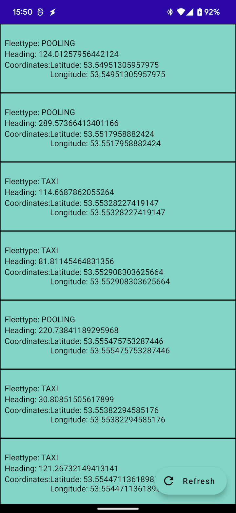
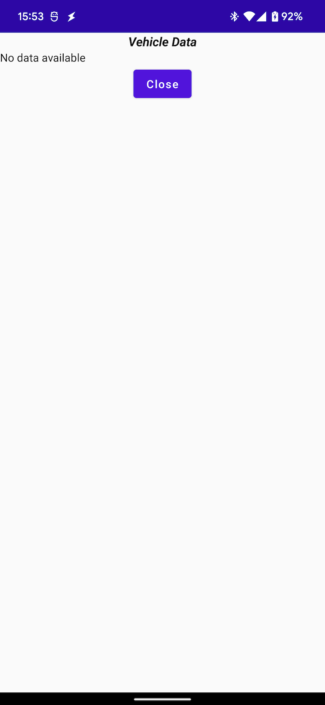

# Free Now Live Coding Challenge for Android

## Info

The live coding interview will be done in a scheduled appointment. You will be presented with some tasks that take place in this project. No upfront coding is required.

As a preparation you should:

- import the project into Android Studio
- make sure it compiles and runs (debug build type)
- make sure you have a working emulator or connected Android Device to be shared via Zoom (for example [scrcpy](https://github.com/Genymobile/scrcpy))
    - sometimes there are technical problems with sharing the screen from the Zoom browser application. You might want to install the client application from https://www.zoom.us
- read this readme to understand the interview process and the structure of the project

## Process of the Interview

The interview will take between 60 and 90 minutes. There will be technical discussions, a coding segment and questions to go deeper into some topics and your experience. There will
also be time for you to ask us technical questions or about working at Free Now in general.

We want to have a nice chat and work together. You will be sharing your screen with us during the call and show your IDE. During the coding make sure to think aloud. You are free
to ask questions or use any kind of extra sources. We are aiming for an atmosphere that is closer to pair programming than it is to an interview as much as possible. We will ask
questions during the coding to discuss approaches and ideas.

## Project "Vehicles"

The application is written using Compose, Dagger Hilt, Navigation Compose and Coroutines/Flow. We do not require you to be an expert in any of the specific technologies, however
the general purpose and underlying principles of these frameworks should be understood (i.e. DI/IOC, Reactive Programming, ViewModel).

The project follows the structure of [Chris Bane's "Tivi" App](https://github.com/chrisbanes/tivi):

* The :app module does only contain the Application, the MainActivity and the Navigation
* Features have their own modules on ui level (prefixed with "ui-")
* ui-modules depend on :domain which contains the business logic
* the :data module contains apis and repositories
* :domain depends on :data and exposes the dependency transitively

In the project we have not put a huge focus on UI/theming. The details of the UI elements are not the focus of the project or the interview.

There are two screens in the app:

The list of vehicles appears on app start:

The vehicle details show when clicking on an item in the list:

